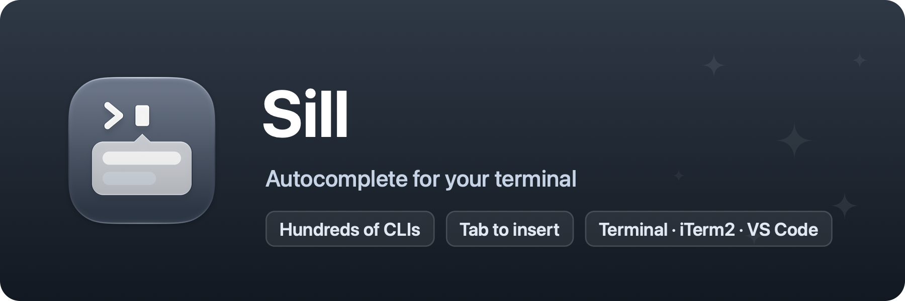

<p align="center">
  
</p>

# Sill

IDE-style autocomplete for the terminal. Part of [Domus](https://domus-apps.com).

A sill is the ledge at the bottom of a window or door, the threshold that
holds what comes next. As you type a command in Terminal, iTerm2, or VS Code, Sill
shows a popup at your cursor with what can come next: subcommands, options,
files, branches, each with a short description. ↑↓ choose, Tab or Return
inserts, Esc dismisses (and then Return runs your command as usual).

## How it works

A one-line zsh integration (installed from the app, removable in Settings,
`~/.zshrc` is backed up first) streams the command line you're editing to
the app over a local socket. Sill parses it against completion definitions
for hundreds of CLIs from the open-source
[withfig/autocomplete](https://github.com/withfig/autocomplete) corpus
(downloaded on first run, refreshed daily), and inserts your choice through
the same shell integration, nothing types keystrokes on your behalf.

Dynamic suggestions (git branches, npm scripts) come from short shell
commands the completion definitions specify, run locally in the session's
working directory with a timeout.

The upstream corpus stopped updating in 2025, so Sill layers its own
definitions on top ([Specs/overrides](Specs/overrides/README.md)) and, if you
turn it on in Settings, learns commands the corpus doesn't know from their
own `--help` output: the program is run once, in the background, with a
quiet environment and a timeout, and what it prints is kept as a local
definition on your Mac. Only real programs are run, a shell script found in
your PATH is never executed for this.

Steering keys (Tab, arrows, Return, Esc) are handled by the same shell
integration, as line-editor bindings active only while the popup is on
screen, nothing observes the keyboard at the system level, so they work
even with Secure Keyboard Entry enabled. Sill needs the Accessibility
permission for one thing: finding the caret's position on screen to place
the popup.

## Limitations

- zsh only, in Terminal.app, iTerm2, VS Code's integrated terminal, Ghostty
  and cmux, for now. Ghostty and cmux expose no caret to accessibility, so
  the popup is placed from the cell grid the terminal reports, a nudge off
  when the prompt uses glyphs whose width the shell misjudges.
- Over ssh, inside tmux, and in full-screen TUIs Sill stays out of the way
  automatically.

## Development

```sh
./Scripts/dev.sh      # rebuild-and-relaunch loop
./Scripts/test.sh     # unit tests
./Scripts/bundle.sh   # assemble build/Sill.app
./Scripts/build-specs.sh  # rebuild the completion-spec bundle
```

Requires macOS 26 or later.
